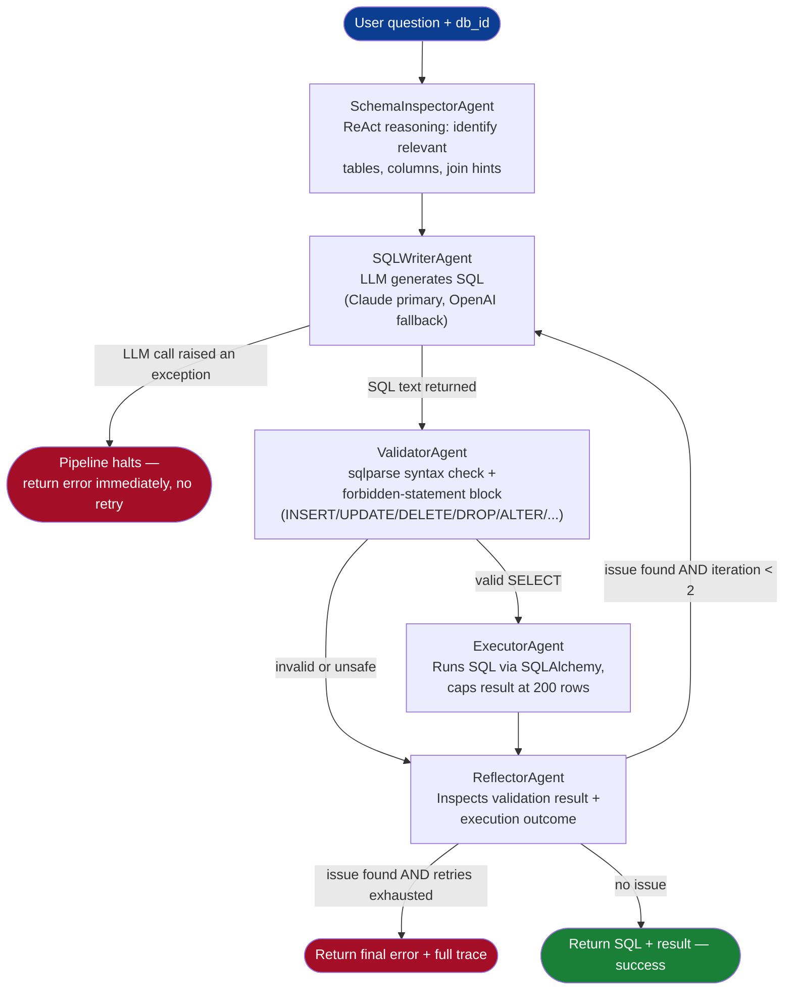
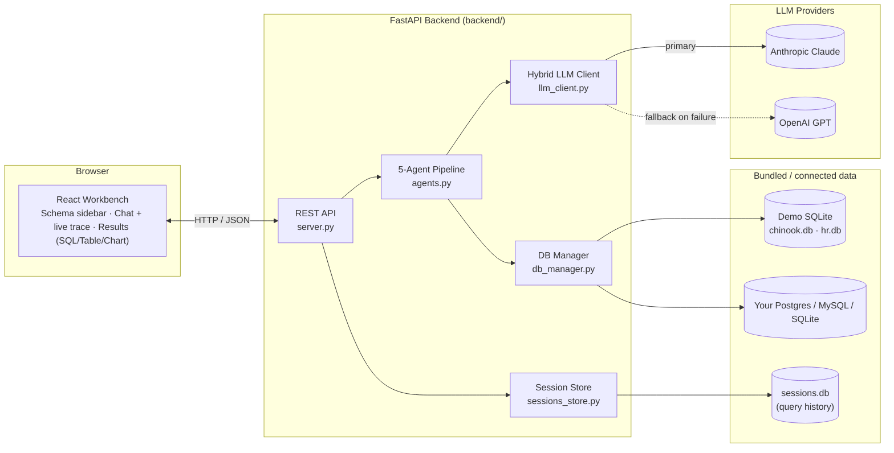

# Multi-Agent Text-to-SQL Intelligence System

Ask a database a question in plain English. A pipeline of five specialized agents
inspects the schema, writes the SQL, validates it for safety, executes it, and
reflects on the result - retrying itself on failure - before handing back an
answer, a chart, and a full trace of what every agent did and why.

Ships with two demo databases (Chinook music store, HR/Projects) seeded automatically,
so there's nothing to configure to try it. Connect your own Postgres/MySQL/SQLite
database from the UI at any time.

---

## Contents

- [Quickstart](#quickstart-docker)
- [Configuration](#configuration)
- [Agent pipeline](#agent-pipeline)
- [System architecture](#system-architecture)
- [API reference](#api-reference)
- [Project layout](#project-layout)
- [Running without Docker](#running-without-docker)
- [Tests](#tests)

---

## Quickstart (Docker)

Requires only [Docker](https://docs.docker.com/get-docker/) — no local Python/Node install needed.

```bash
git clone https://github.com/karthikshetty-1629/Text-To-SQL.git
cd Text-To-SQL

cp backend/.env.example backend/.env      # add your ANTHROPIC_API_KEY (or OPENAI_API_KEY)
cp frontend/.env.example frontend/.env    # defaults are fine for local use

docker compose up --build
```

Open **http://localhost:3000**. The backend, both demo databases, and session-history
storage are all self-contained inside the containers — nothing else to install or run.

To stop: `Ctrl+C`, then `docker compose down`.

---

## Configuration

Backend config lives in `backend/.env` (copy from `backend/.env.example`):

| Variable | Purpose | Default |
|---|---|---|
| `ANTHROPIC_API_KEY` | Claude API key — primary LLM provider | *(required — or set OpenAI)* |
| `OPENAI_API_KEY` | OpenAI API key — automatic fallback if the primary provider errors or is unset | *(optional)* |
| `LLM_PROVIDER` | Which provider to try first: `anthropic` or `openai` | `anthropic` |
| `ANTHROPIC_MODEL` | Claude model ID | `claude-sonnet-4-5-20250929` |
| `OPENAI_MODEL` | OpenAI model ID | `gpt-4o` |
| `LLM_MAX_TOKENS` | Max output tokens per agent LLM call | `2048` |
| `CORS_ORIGINS` | Comma-separated origins allowed to call the API | `http://localhost:3000` |

You need **at least one** of `ANTHROPIC_API_KEY` / `OPENAI_API_KEY` set for queries to run.
If the primary provider fails (bad key, rate limit, outage), `llm_client.py` automatically
retries the call on the other configured provider before giving up.

Frontend config lives in `frontend/.env` (copy from `frontend/.env.example`):

| Variable | Purpose | Default |
|---|---|---|
| `REACT_APP_BACKEND_URL` | Base URL the browser uses to reach the backend | `http://localhost:8000` |

---

## Agent pipeline

Each question runs through five agents orchestrated by `run_pipeline()` in
[`backend/agents.py`](backend/agents.py). Schema inspection runs once; SQL writing,
validation, execution, and reflection form a loop that can retry up to **2 times**
before giving up.



**What each agent actually does:**

| Agent | File | Responsibility |
|---|---|---|
| `schema_inspector` | `agents.py` | Sends the full schema + question to the LLM, asks it to reason step-by-step (ReAct style) about which tables/columns/joins are relevant. Runs once per query, feeds hints to the writer. |
| `sql_writer` | `agents.py` | Generates a single dialect-aware `SELECT` statement. On a retry, it also receives the previous SQL and the specific failure reason, and is told to fix it. |
| `validator` | `agents.py` | Parses the SQL with `sqlparse` and rejects it if parsing fails or if it contains `INSERT`, `UPDATE`, `DELETE`, `DROP`, `ALTER`, `TRUNCATE`, or `CREATE` — enforced as a hard safety gate, not just a prompt instruction. |
| `executor` | `agents.py` (calls `db_manager.execute_sql`) | Runs the validated SQL against the target database via SQLAlchemy and returns rows/columns. |
| `reflector` | `agents.py` | Looks at the validation/execution outcome. If something went wrong and fewer than 2 retries have happened, routes back to `sql_writer` with the failure reason attached. Otherwise ends the pipeline. |

Every step emits a trace event (agent, status, message, data, timestamp) via
`TraceCollector`, returned in the API response and rendered live in the UI's agent trace panel.

---

## System architecture



No external services are required — both the demo databases and session history are
plain SQLite files bundled inside `backend/demo_dbs/`.

---

## API reference

All routes are prefixed with `/api`.

| Method | Path | Description |
|---|---|---|
| `GET` | `/databases` | List registered databases (demo + connected) |
| `POST` | `/databases/connect` | Connect a Postgres/MySQL/SQLite database (`{name, url, type}`); tests the connection before registering |
| `GET` | `/schema/{db_id}` | Full schema: tables, columns, foreign keys, row counts |
| `POST` | `/query` | Run a natural-language question through the agent pipeline (`{question, db_id, session_id?}`) |
| `GET` | `/sessions` | List recent query sessions (lightweight, no trace/result payload) |
| `GET` | `/sessions/{id}` | Full session detail, including trace and result |
| `DELETE` | `/sessions/{id}` | Delete a session |

---

## Project layout

```
Text-To-SQL/
├── backend/
│   ├── server.py          # FastAPI app, REST routes
│   ├── agents.py          # 5-agent pipeline + orchestrator
│   ├── llm_client.py      # Hybrid Anthropic/OpenAI client
│   ├── db_manager.py      # Demo DB seeding, schema introspection, query execution
│   ├── sessions_store.py  # SQLite-backed session history
│   ├── demo_dbs/          # Bundled chinook.db, hr.db, sessions.db (generated)
│   ├── tests/             # pytest unit + integration tests
│   ├── requirements.txt
│   └── Dockerfile
├── frontend/
│   ├── src/
│   │   ├── pages/Workbench.jsx        # 3-pane main UI
│   │   ├── components/                # SchemaSidebar, AgentTrace, ResultPanel, ConnectDBDialog
│   │   └── lib/                       # api.js, sqlHighlight.js
│   ├── package.json
│   └── Dockerfile
├── docker-compose.yml
└── README.md
```

---

## Running without Docker

```bash
# backend
cd backend
python3 -m venv venv && source venv/bin/activate
pip install -r requirements.txt
cp .env.example .env   # add your API key
uvicorn server:app --reload --port 8000

# frontend (separate terminal)
cd frontend
cp .env.example .env
yarn install
yarn start
```

---

## Tests

```bash
# unit tests (no API key or running server needed)
cd backend && python -m pytest tests/test_validator_unit.py

# integration tests (needs the backend running at REACT_APP_BACKEND_URL, default localhost:8000)
cd backend && python -m pytest tests/backend_test.py
```
